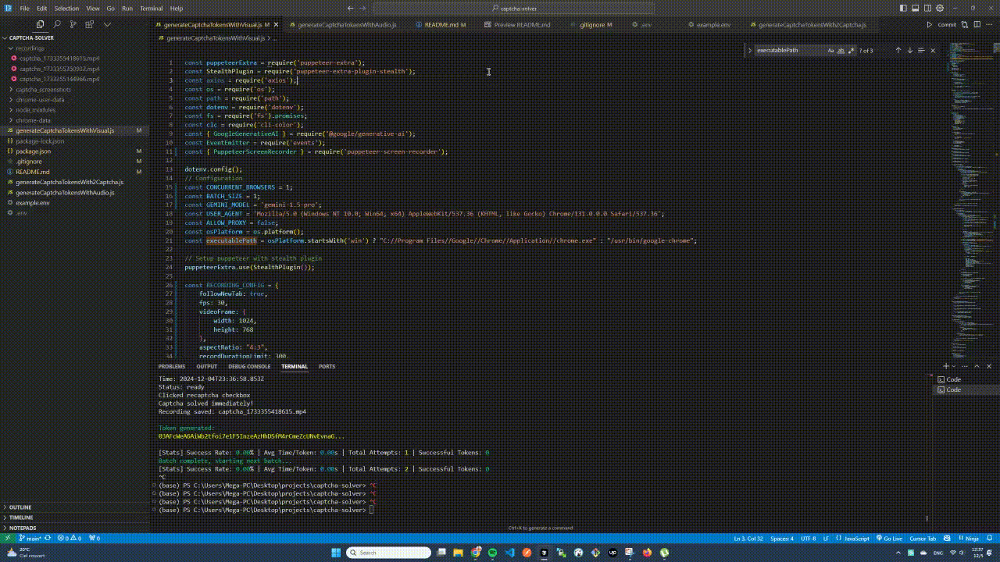

# ReCaptcha Bypass Solutions

A collection of methods to solve Google ReCaptcha v2 challenges using different approaches. This project provides three different methods to bypass ReCaptcha:


## Available Methods

### 1. 🎧 Audio Challenge Method 
- Uses wit.ai to transcribe ReCaptcha audio challenges
- Requires FREE wit.ai API keys
- Average success rate: 70-80%

### 2. 👥 2Captcha Service
- Uses paid human captcha solving service
- Most reliable but costs money ($2.99 per 1000 solves)
- Requires 2captcha API key
- Success rate: 95%+

### 3. 🤖 Visual Challenge Method (Experimental)
- Uses AI (Gemini) to solve visual challenges
- Experimental and less reliable
- requires Free Gemini API keys
- Success rate: varies

## Visual Challenge bypass demo: See Google Gemini solving Google ReCaptcha in action




## Features

- Multiple bypass methods to choose from
- Event-driven architecture for easy integration
- Configurable concurrent browser instances
- Detailed logging and statistics
- Proxy support
- Stealth browser configurations

## Prerequisites

```bash
npm install puppeteer-extra puppeteer-extra-plugin-stealth axios dotenv cli-color undici
```

## Configuration

Create a `.env` file in your project root:

```env
# Audio Challenge Tokens (wit.ai API keys)
WIT_TOKEN=your_wit_token_here
WIT_TOKEN_1=your_backup_token_1
WIT_TOKEN_2=your_backup_token_2

# Visual Challenge API Keys (experimental)
GEMINI_API_KEY=your_gemini_api_key
OPENROUTER_API_KEY=your_openrouter_api_key

# 2Captcha
2CAPTCHA_API_KEY=your_2captcha_api_key

# Proxy Configuration (optional)
PROXY_HOST=your_proxy_host
PROXY_PORT=your_proxy_port
PROXY_USERNAME=your_proxy_username
PROXY_PASSWORD=your_proxy_password

# Method Selection
CAPTCHA_METHOD=audio  # Options: 'audio', '2captcha', 'visual'
```

## Usage

### Method 1: Event-Based Integration

```javascript
const EventEmitter = require('events');
const generateCaptchaTokens = require('./generateCaptchaTokensWithAudio');
// Or use: require('./generateCaptchaTokensWith2Captcha')
// Or use: require('./generateCaptchaTokensWithVisual')

const eventEmitter = new EventEmitter();

// Listen for successful tokens
eventEmitter.on('tokenGenerated', (data) => {
    console.log('Captcha Token:', data.token);
});

// Listen for errors
eventEmitter.on('tokenError', (data) => {
    console.error('Error:', data.error);
});

// Start generating tokens
generateCaptchaTokens(eventEmitter);
```

### Method 2: Direct Integration

You can copy the relevant solver code into your project and modify the `solveCaptchaChallenge` function to fit your specific needs.

## Configuration Options

Each solver can be configured with these parameters:

```javascript
const CONCURRENT_BROWSERS = 2;  // Number of browser instances
const TABS_PER_BROWSER = 1;     // Tabs per browser
const ALLOW_PROXY = false;      // Enable/disable proxy
```

## Statistics and Monitoring

The solution includes a `ResultTracker` class that provides:
- Success rate
- Average time per token
- Total attempts
- Successful tokens count

## Notes

- Use proxies to prevent IP bans
- Rotate user agents and browser profiles
- Handle rate limiting appropriately
- Consider legal and ethical implications

## Disclaimer

This project is for educational purposes only. Use of automated systems to bypass CAPTCHAs may violate terms of service of some websites. Always ensure you have permission to use automated solutions on target websites.

